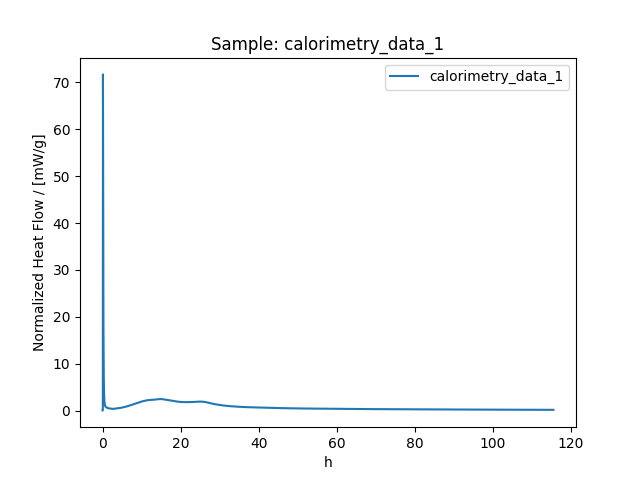
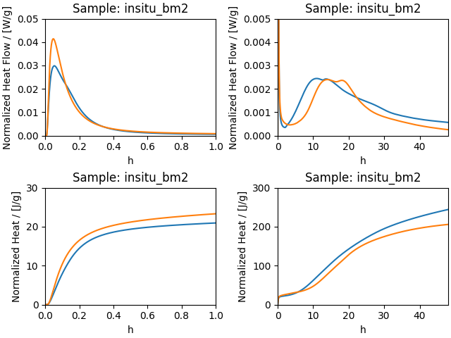

# Plotting
There are many different use cases for isothermal calorimetry. Here, we focus on the application of isothermal heat flow calorimetry for the hydration of cementitious materials.

## Basic Plotting of Calorimetry Data

Assume that your calorimetry data is found inside a folder called `calo_data` and your Python script `myscript.py`is in the working directory.
```bash
.
├── myscript.py
└── calo_data
    ├── calofile1.csv
    └── calofile2.csv
```

It is very easy to load the calorimetry files and to plot them. The file `myscript.py` could read like this. First, we create a Path object `datapath` using the pathlib package that is directed at the folder which contains the raw instrument data. Then we pass the the `datapath` object to `ta.Measurement()`. The option `show_info=True` prints the names of the calo files being loaded in the terminal.

```python
from TAInstCalorimetry import tacalorimetry as ta
from pathlib import Path

datapath = Path(__file__).parent / "calo_data"

# create the calorimetry Measurement object
tam = ta.Measurement(
    folder=datapath,
    show_info=True,
    auto_clean=False,
)

# plot the data
tam.plot()

```
This would yield something like the following plot:



The plot has at least three issues:

* the y-axis and the x-axis are automatically scaled to include the maximumum values
* the legend is not visible
* by default the plot method plots the normalized heat flow in mW/g, maybe another parameters is desired


## Customizing the plot

### Choosing different variables for the y-axis

If only a different y-axis variable is desired, this can simply be achieved by defining the name of the desired parameter:

```python
tam.plot(y="heat_j_g")

```


### Full customization

The `plot()` method returns a Matplotlib axes object. 
Therefore, we can manipulate the plot as normal, e.g., by defining the limits of both axes or by defining the location of the legend (as shown in the code below).

```python
ax = tam.plot(
    y="normalized_heat_flow_w_g",
    t_unit="h",  # time axis in hours
    y_unit_milli=True,
)

# set upper limits
ax.set_ylim(0, 6)
ax.set_xlim(0, 48)
ax.legend(bbox_to_anchor=(1., 1), loc="upper right")
```


## Plotting Heat Flow and Heat in Subplots

Often, both the initial phase of hydration is of interest and also both the heat flow and the heat are relevant. 
Here is code which allows plotting such data to a neat 2x2 grid.

```python
plot_configs = [
    {"ycol": "normalized_heat_flow_w_g", "xlim": 1, "ylim": 0.05},
    {"ycol": "normalized_heat_flow_w_g", "xlim": 48, "ylim": 0.005},
    {"ycol": "normalized_heat_j_g", "xlim": 1, "ylim": 30},
    {"ycol": "normalized_heat_j_g", "xlim": 48, "ylim": 300},
]

fig, axs = ta.plt.subplots(2, 2, layout="constrained")
for ax, config in zip(axs.flatten(), plot_configs):
    tam.plot(y=config["ycol"], t_unit="h", y_unit_milli=False, ax=ax)
    ax.set_xlim(0, config["xlim"])
    ax.set_ylim(0, config["ylim"])
    ax.get_legend().remove()
ta.plt.show()
```

