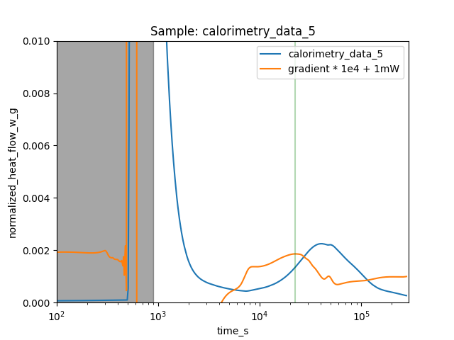

# Quantification of Calorimetry Data

## Peak Detection

First we load the data

```python
# %%
from pathlib import Path
import calocem.tacalorimetry as ta
from calocem.processparams import ProcessingParameters

# define the Path of the folder with the calorimetry data
datapath = Path()

# experiments via class
tam = ta.Measurement(
    folder=datapath,
    regex=r".*file.*",
    show_info=True,
    auto_clean=False,
    cold_start=True,
)

```
Then, before we apply the `get_peaks()` method, we can define the ProcessingParameters if the default options are not suitable.
Here we define the peak prominence and give it the value 1e-4.
Note that only the largest peak will be detected if the prominence is set to 1e-3 in this example.

```python
# define the processing parameters
processparams = ProcessingParameters()
processparams.peakdetection.prominence = 1e-4

# plot the peak position
fig, ax = ta.plt.subplots()

# get peaks (returns both a dataframe and extends the axes object)
peaks_found = tam.get_peaks(processparams, plt_right_s=3e5, ax=ax, show_plot=True)
ax.set_xlim(0, 100000)
ta.plt.show()

```


`peaks_found` is a tuple. 
The first element contains the Dataframe with the parameters of the detected peaks.
It could be exported to a csv file via

```python

df = peaks_found[0].iloc[:,[0,5,6,9]]
df.to_csv(plotpath / "example_get_peaks.csv", index=False)
```

The dataframe looks like this:

{{ read_csv('assets/example_get_peaks.csv') }}


## Maximum Slope (of C3S Reaction) Detection

Programmatic, automatic detection the maximum slope can be a little tricky.
The first example is straightforward and looks a normal Portland cement hydration case.
Assuming that the data is already loaded, we can inistantiate the ProcessingParameters object.
The algorithm detects the maxima of the gradient of the heat flow.
It is therefore very useful to apply a little smoothing to the first derivative.

```python

processparams = ProcessingParameters()
processparams.spline_interpolation.apply = True
processparams.spline_interpolation.smoothing_1st_deriv = 1e-12

# get peak onsets via alternative method
fig, ax = ta.plt.subplots()
onsets_spline = tam.get_maximum_slope(
    processparams=processparams,
    show_plot=True,
    ax = ax
)
```
If we set the parameter `show_plot` to `True`, we get a nice visual feedback on the gradient and the detected maximum slope (as a green line).
The gradient is multiplied by a factor of 10.000 and shifted upwards.

