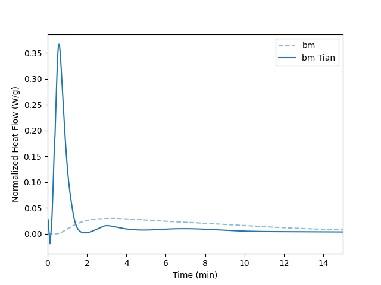

<<<<<<< HEAD
# Tian Correction

## Example Workflow Two Tau Constants

### Load the Data
=======
## Tian Correction
>>>>>>> origin/main

For fast reactions, e.g., reactions occuring during the first minutes of cement hydration, the thermal inertia of the calorimeter significantly broadens the heat flow signal. 
If the characteristic time constants are determined experimentally, a Tian correction can be applied to the heat flow data.

<!-- Assuming the file structure outlined above, we can apply the Tian correction using the following code.
Please note, that the values for tau1 and tau2 need to be experimentally determined for the experimental setup.
The other processing parameters, i.e., the Median Filter and the spline interpolation are necessary to smoothen the gradients.
The default behavior of is `False`. -->

First we load the data.

```python

from pathlib import Path

import matplotlib.pyplot as plt

import TAInstCalorimetry.tacalorimetry as ta

datapath = Path(__file__).parent / "calo_data"

# load experimental data
tam = ta.Measurement(
    folder=datapath,
    regex=r".*file1.csv",
    show_info=True,
    auto_clean=False,
    cold_start=True,
)

```

<<<<<<< HEAD
### Define the Processing Parameters

=======
>>>>>>> origin/main
In the next step, we need to define a few parameters which are necessary for the Tian correction. 
Therefore we create a ProcessingParameters object which we call `processparams` in this case.
The `processparams` object has a number of attributes which we can define.
First, we define two time constants `tau1` and `tau2`.
The numeric value needs to be determined experimentally.

```python

# Set Proceesing Parameters
processparams = ta.ProcessingParameters()
processparams.time_constants.tau1 = 240
processparams.time_constants.tau2 = 80
processparams.median_filter.apply = True
processparams.median_filter.size = 15
processparams.spline_interpolation.apply = True
processparams.spline_interpolation.smoothing_1st_deriv = 1e-10
processparams.spline_interpolation.smoothing_2nd_deriv = 1e-10
```

<<<<<<< HEAD
### Apply the Tian Correction

=======
>>>>>>> origin/main
Next we apply the Tian correction by calling the method `apply_tian_correction()`.
We pass the `processparams` object defined above to the method.

```python
# apply tian correction
tam.apply_tian_correction(
    processparams=processparams,
)

```

<<<<<<< HEAD
### Plot the Data
=======
>>>>>>> origin/main
Finally, we can get the Pandas dataframe containing the calorimetric data by calling `get_data()`.
Using the `df` DataFrame we can plot the calorimetry data using well-known Matplotlib methods.

```python

df = tam.get_data()

# plot corrected and uncorrected data
fig, ax = plt.subplots()
ax.plot(
    df["time_s"] / 60,
    df["normalized_heat_flow_w_g"],
    linestyle="--",
    label="sample"
    )
ax.plot(
    df["time_s"] / 60,
    df["normalized_heat_flow_w_g_tian"],
    color=ax.get_lines()[-1].get_color(),
    label="Tian corrected"
    )
ax.set_xlim(0, 15)
ax.set_xlabel("Time (min)")
ax.set_ylabel("Normalized Heat Flow (W/g)")
ax.legend()
plt.show()


```




## One or Two Tau Values

If only one Tau value is defined, the correction algorithm will only consider this $\tau$ value and the data will be corrected according to 

\[
P(t) = \varepsilon \left[ U(t) + \tau \frac{dU(t)}{dt} \right]
\]

If two values for $\tau$ are provided, the data will be corrected considering both values.

\[
P(t) = \varepsilon \left[ U(t) + (\tau_1+\tau_2) \frac{dU(t)}{dt} + \tau_1\tau_2 \frac{d^2U}{dt^2} \right]
\]

The actual implementation of the correction algorithm is not based on the voltage $U$ but on the heat flow. 
In most cases, the exported data does not contain the raw voltage data but the heat flow data which has been obtained in the instrument software with the experimentally determined value for $\varepsilon$.

Therefore, the second equation reads like

\[
\dot{Q}_{Tian}(t) =  \dot{Q}(t) + (\tau_1+\tau_2) \frac{\dot{Q}}{dt} + \tau_1\tau_2 \frac{d^2\dot{Q}}{dt^2} 
\]

In pratical terms, if only the attribute tau1 is set, only the first derivative of the heat flow will be considered.

```python

# Set Proceesing Parameters
processparams = ta.ProcessingParameters()
processparams.time_constants.tau1 = 240
```


## Smoothing the Data

It is important to smoothen the data. 
Otherwise, small noise in the raw heat flow data will lead to significant noise especially in the second derivative.


```python

# Set Proceesing Parameters
processparams = ta.ProcessingParameters()
processparams.time_constants.tau1 = 240
processparams.time_constants.tau2 = 80 
processparams.median_filter.apply = True
processparams.median_filter.size = 15
processparams.spline_interpolation.apply = True
processparams.spline_interpolation.smoothing_1st_deriv = 1e-10
processparams.spline_interpolation.smoothing_2nd_deriv = 1e-10
```
